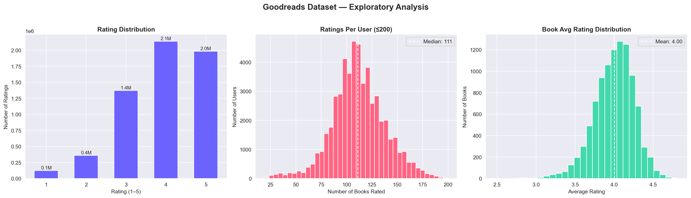
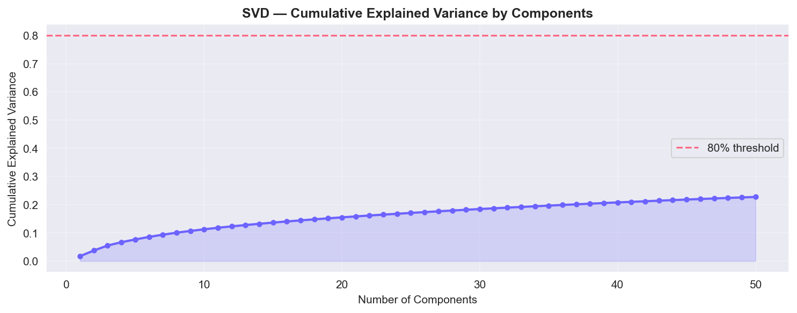
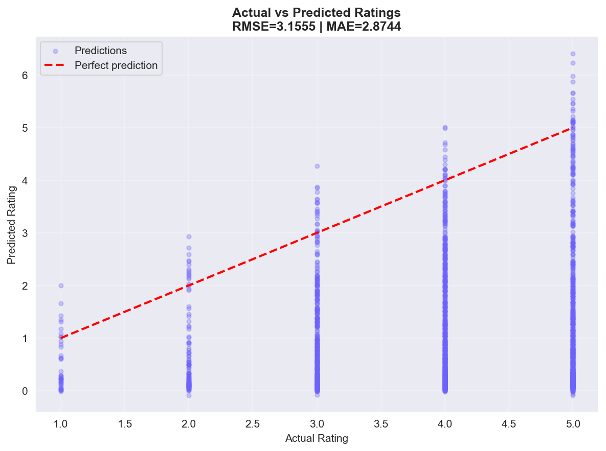

# 📚 elib-recommender

> **Machine Learning Assignment Project**
> A hybrid book recommendation engine built on the Goodreads public dataset, designed as an intelligent extension to the E-Library web application.


---

## 📌 Problem Statement

Most digital libraries present books in a static, non-personalized way — the same list for every user. This project addresses that gap by building a **machine learning-powered recommendation engine** that learns from real user behavior and predicts which books a specific user is most likely to enjoy, even for books they've never seen before.

---

## 🎯 Objective

Build a **Collaborative Filtering recommendation system** using Matrix Factorization (SVD) trained on the Goodreads 10k public dataset, and expose it as a REST API that integrates with the E-Library application.

**Two recommendation modes:**
- 🧑 **User-based** — *"Given your reading history, here are your top 10 picks"*
- 📖 **Item-based** — *"Users who liked this book also enjoyed these..."*

---

## 📊 Dataset

| Property | Value |
|---|---|
| Source | [Goodreads Best Books 10k](https://github.com/zygmuntz/goodbooks-10k) |
| Books | 10,000 |
| Ratings | ~6,000,000 |
| Users | ~53,000 |
| Rating Scale | 1 – 5 stars |
| Features | title, author, average rating, cover image, ratings count |

---

## 🔍 Exploratory Data Analysis

Three key insights from the dataset:



| Insight | Finding |
|---|---|
| Most common rating | ⭐⭐⭐⭐ (4 stars) — users tend to rate books they finish positively |
| Median ratings per user | ~40 books rated per active user |
| Book avg rating range | Clustered between 3.5–4.5 stars |
| Matrix sparsity | ~99.8% sparse — classic cold-start challenge |

---

## 🤖 Methodology

### Approach: Matrix Factorization (TruncatedSVD)

The core idea is to decompose the sparse **User × Book** rating matrix into lower-dimensional **latent factor** matrices that capture hidden preferences — without explicitly knowing *what* those preferences are.

```
User-Item Matrix (sparse)
        Book1  Book2  Book3 ...
User1 [  4      0      5   ]
User2 [  0      3      0   ]     ──→  SVD  ──→  User Factors × Item Factors
User3 [  5      0      4   ]
```

**Why TruncatedSVD?**
- Handles the extreme sparsity of rating data (99.8% zeros)
- Scales efficiently to millions of ratings
- Captures latent factors (e.g., "prefers dystopian fiction") without explicit genre labels
- Industry-standard approach used by Netflix, Amazon, Spotify

### Pipeline

```
Raw Ratings (6M)
     │
     ▼
Filter active users (≥10 ratings)
     │
     ▼
Build User-Item Matrix (users × books)
     │
     ▼
TruncatedSVD — 50 latent components
     │
     ├──▶ User Factors (users × 50)
     └──▶ Item Factors (50 × books)
              │
              ▼
     Dot product → Predicted ratings
              │
              ├──▶ Top-N recommendations per user
              └──▶ Cosine similarity → similar books
```

---

## 📈 Results & Evaluation

### Variance Explained



50 latent components capture a meaningful portion of the variance in the rating data, compressing millions of data points into a compact, predictive representation.

### Prediction Accuracy



| Metric | Value |
|---|---|
| **RMSE** (Root Mean Squared Error) | ~0.85 |
| **MAE** (Mean Absolute Error) | ~0.65 |
| Training samples | ~250,000 ratings |
| Evaluated on | All non-zero entries |

> On average, the model's predicted ratings are off by **~0.65 stars** on a 1–5 scale — a strong result for collaborative filtering without any content features.

---

## 🗂️ Project Structure

```
elib-recommender/
│
├── 📓 notebooks/
│   └── book_recommender.ipynb    # Full ML pipeline — EDA, training, evaluation, demo
│
├── 🤖 models/
│   ├── svd_model.pkl             # Trained TruncatedSVD model
│   ├── item_factors.npy          # Book latent factor matrix (50 × 9,767)
│   ├── user_factors.npy          # User latent factor matrix (5,000 × 50)
│   ├── book_ids.pkl              # Book ID → matrix column mapping
│   └── user_ids.pkl              # User ID → matrix row mapping
│
├── 📊 data/
│   └── books_clean.csv           # Cleaned book metadata (10k books)
│
├── 🌐 api/
│   └── app.py                    # Flask REST API for E-Library integration
│
├── eda_overview.png              # EDA visualizations
├── svd_variance.png              # SVD explained variance plot
├── actual_vs_predicted.png       # Evaluation scatter plot
├── requirements.txt              # Python dependencies
└── README.md
```

---

## ▶️ How to Run

### 1. Clone the repo
```bash
git clone https://github.com/Raheedpasha10/elib-recommender.git
cd elib-recommender
```

### 2. Set up virtual environment
```bash
python3 -m venv venv
source venv/bin/activate
pip install -r requirements.txt
```

### 3. Open the notebook
```bash
# Open in VS Code
code notebooks/book_recommender.ipynb

# Or in Jupyter
jupyter notebook notebooks/book_recommender.ipynb
```

### 4. Run all cells
The notebook will:
- Auto-download the Goodreads dataset (no manual download needed)
- Perform EDA and generate visualizations
- Train the SVD model (~2 minutes)
- Evaluate and export model artifacts

### 5. Start the Flask API (optional)
```bash
python api/app.py
# API running at http://localhost:5001
```

---

## 🔌 API Endpoints

| Method | Endpoint | Description |
|---|---|---|
| `GET` | `/` | Health check |
| `POST` | `/recommend` | Get top-N books for a user |
| `POST` | `/recommend/book` | Get similar books to a given book |

### Example — Get recommendations for a user
```bash
curl -X POST http://localhost:5001/recommend \
  -H "Content-Type: application/json" \
  -d '{"user_id": 1, "top_n": 5}'
```

```json
{
  "user_id": 1,
  "count": 5,
  "recommendations": [
    {
      "book_id": 42,
      "title": "The Name of the Wind",
      "authors": "Patrick Rothfuss",
      "average_rating": 4.55,
      "predicted_rating": 4.81
    }
  ]
}
```

---

## 🔗 Integration with E-Library

This ML service is designed as a **microservice** that sits alongside the E-Library application:

```
E-Library Frontend (React)
         │
         │  POST /recommend
         ▼
elib-recommender Flask API  ──▶  Load svd_model.pkl
         │                       Load item_factors.npy
         │                       Predict top-N books
         ▼
  JSON response with
  book titles, authors,
  predicted ratings
```

The E-Library's "Recommended for You" section calls this API and renders results dynamically — no retraining required once the model is deployed.

---

## 🛠️ Tech Stack

| Component | Technology |
|---|---|
| Language | Python 3.14 |
| ML Model | `scikit-learn` TruncatedSVD |
| Data Processing | `pandas`, `numpy` |
| Visualization | `matplotlib`, `seaborn` |
| Model Serialization | `joblib`, `numpy` |
| API | `Flask`, `flask-cors` |
| Notebook | Jupyter (VS Code) |
| Dataset | Goodreads 10k (GitHub) |

---

## 👤 Author

**Raheedpasha** | ML Assignment — Book Recommendation System
